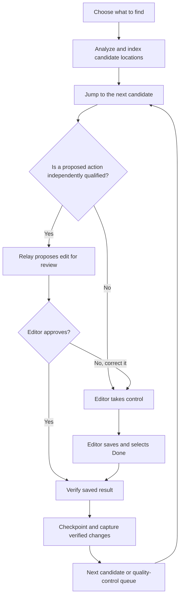
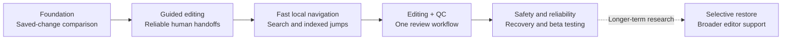

# Project Relay — Product Roadmap

> **Status: pre-alpha | Development codename | Updated October 2026**
>
> **Vision:** Make editing faster without taking creative control away from the editor.
> Project Relay aims to find useful edit locations, guide people to them, automate
> appropriately verified repetitive tasks, and make every change reviewable and recoverable.
>
> This is a **milestone roadmap**, not a release schedule or a feature availability promise.
> Features shown as planned or exploratory are not available in a public product.

## The product we're building

Instead of requiring someone to scrub through hours of footage—or trust an
unreviewed fully automatic edit—Relay is intended to offer a practical middle
ground:

1. **Find:** Scan media and identify candidate cuts, silences, transitions,
   titles, recurring footage, and audio concerns.
2. **Go:** Navigate directly to the selected location in the supported editor.
3. **Choose:** Let Relay propose a qualified action, or take over and edit normally.
4. **Confirm:** Review the result and correct it when needed.
5. **Remember:** Record approved saved changes as evidence for future rule testing.
6. **Review and recover:** Revisit flagged edits or restore verified work when possible.

The goal is to reduce **total human time per accepted edit**, including seeking,
editing, quality control, correction, and recovery.

### Product experience — concept

*This depicts the intended product flow. Only a bounded, human-operated
guided handoff and saved-change capture have been demonstrated so far;
automatic proposals are not yet independently qualified.*

## Milestones

*Workstreams can overlap. This diagram indicates direction, not release dates.*

| Milestone | Current status | What must be demonstrated before calling it complete |
| --- | --- | --- |
| **Saved-edit comparison** | **Prototype demonstrated** | Expand supported project structures and validate comparisons across more real projects without mistaking saved geometry for editorial intent. |
| **Guided human editing** | **First live manual handoff demonstrated** | Repeated navigate → handoff → save → capture → advance cycles, including pause, resume, interruption, and recovery. |
| **Fast navigation and discovery** | **Planned** | Build a local candidate index and direct navigation path; measure speed and landing accuracy rather than relying on per-click AI or manual timecode entry. |
| **Searchable edit targets** | **Planned** | Allow filters and plain-language requests such as silences above a threshold, transitions, titles, and repeated segments; validate each detector. |
| **Adaptive automatic proposals** | **Research / not qualified** | Use confirmed examples, explicit evidence, held-out tests, and human approval before allowing a proposed edit. Similarity alone never grants permission. |
| **Integrated quality control** | **Planned** | Use the same navigation queue to visit flagged or completed edits, listen/view context, confirm, correct, and resume. |
| **Project history and backup controls** | **Limited recovery foundation demonstrated; product controls planned** | Verified checkpoints, restart recovery, visible storage usage, protected originals, and explicit optional cleanup. |
| **Selective edit/section restore** | **Exploratory** | Restore an earlier isolated edit while preserving independent later changes; detect and preview dependencies or conflicts. |
| **External beta** | **Not open** | Reliable onboarding, meaningful measured time savings, safe recovery, actionable error handling, documented limitations, and real user testing. |
| **More editor integrations** | **Long-term goal** | Independently qualify editor-specific adapters; the current development focus is Filmora. |

## Evidence from the current pre-alpha

- Native saved-project comparison recovered removed video and audio intervals,
  retained detached audio, and serialized fade settings in a bounded test.
- Observation rules recognized **6 of 6** held-out examples in the initial
  comparison experiment, with **20 focused tests** passing. This demonstrates
  **recognition of saved changes**, not the ability to choose artistic edits.
- A later blind saved-project comparison identified **eight video removals,
  eight audio removals, four retained detached audio clips, and three
  positive saved fade-outs** without receiving an explanation of those edits.
- One live guided-editing session successfully navigated to a candidate,
  handed control to the editor, captured the saved manual change, and paused
  safely. The accompanying validation recorded **27 of 27 focused tests passing**.
  Navigation required active development assistance; this was not a standalone
  rapid-seeking demonstration. Automatic-proposal lifecycle checks used a
  simulated executor, not a qualified live automatic editorial proposal.

These are **limited prototype observations**, not independent performance
benchmarks or evidence that unattended editing works. Rendered audiovisual
quality, general navigation reliability, and automatic editorial decisions
need further qualification.

## Non-negotiable design principles

**The human stays in control.** A user can choose to edit manually, reject
proposed changes, or postpone uncertain work. Relay should never claim to know
an artistic reason solely from project geometry.

**Interactive actions should feel immediate.** Expensive AI/media analysis
should be performed ahead of interaction when feasible. Navigation should use
local indexes and verified editor controls. Low-latency seeks are a performance
goal, **not a current guarantee**.

**Editing and QC share one workflow.** The same candidate location and
navigation system should help users make edits and inspect completed ones.

**Learning is evidence-based.** Relay can record approved examples and test
reusable decision rules. Capturing one correction does not automatically
retrain an AI model or authorize the next similar edit.

**Recovery is built in, not bolted on.** Originals and user-authored projects
must remain distinct from temporary working copies. Checkpoints and restore
paths need real tests. Relay-owned backups may be cleaned up only after
informed, explicit user confirmation.

**Editor compatibility is earned through testing.** A feature validated in one
editor or workflow is not automatically supported elsewhere.

## What comes before a beta

Before inviting external editors to test Relay, the project should demonstrate:

- Several consecutive guided sessions with reliable current-location seeking,
  editor-control handoff, saved-state capture, and safe resume.
- A useful candidate-search and QC flow that saves measurable time compared
  with editing without Relay.
- Recovery under crashes, interrupted saves, missing assets, and rejected
  proposals without sacrificing original work.
- Honest feature boundaries, reproducible tests, accessible controls, clear
  installation guidance, and a straightforward issue-reporting process.
- An explicit opt-in for any automatic action not already confirmed by the user.

## Preserved longer-term directions

The earlier roadmap also identified project creation/media import, onboarding
and configuration, copyright-safe demonstrations, and a stable graphical workflow.
These remain planned. Filmora, DaVinci Resolve, and Adobe Premiere Pro are an
intended longer-term adapter direction; none is promised for a particular release.

A native media-processing backend and optional native timeline/editor capabilities
remain exploratory possibilities. They are not implemented product commitments.

## Follow development

The public [development status](docs/DEVELOPMENT_STATUS.md),
[changelog](CHANGELOG.md), and this roadmap describe **different things**:
what has actually been tested, what changed, and what we hope to develop next.
Update these together after a verified milestone, changed dependency, or revised
priority. Feature suggestions should include the editing problem, desired outcome,
priority, dependencies, and an observable acceptance criterion. Do not attach
private media, project files, credentials, or internal evidence to public issues.

Project Relay is a development codename, not the final commercial product
name. It is currently pre-alpha, **not a publicly released beta**.
No dates or third-party editor support are promised.
